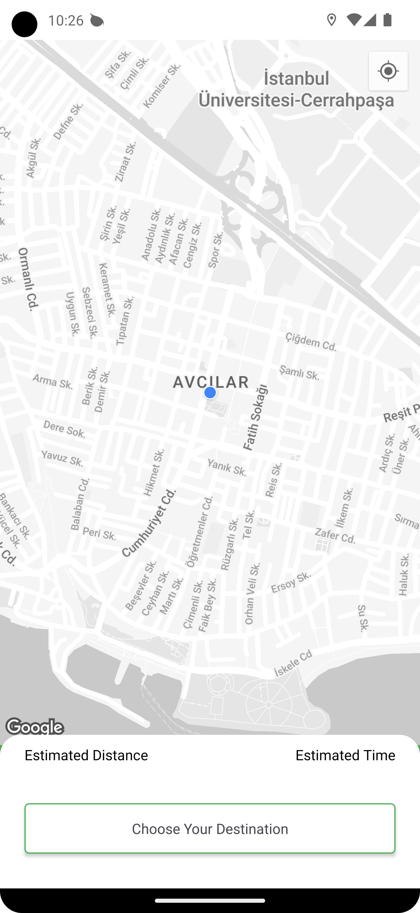
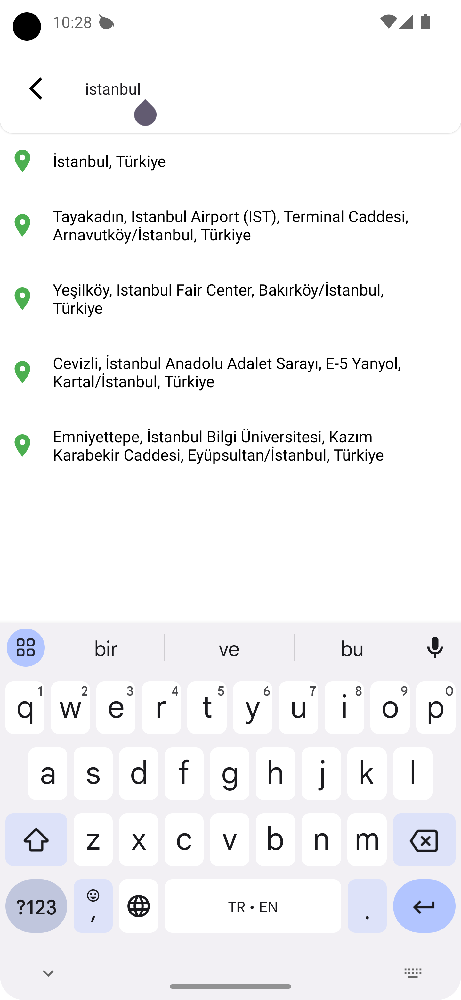
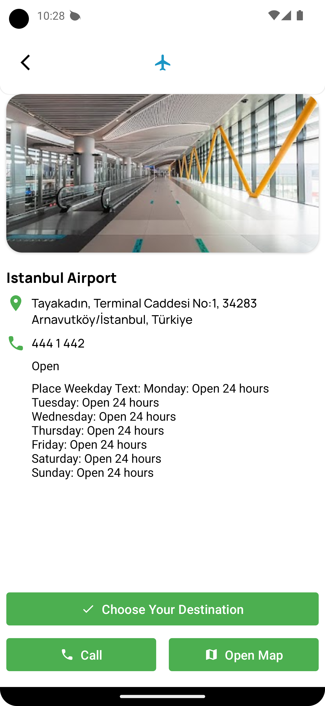
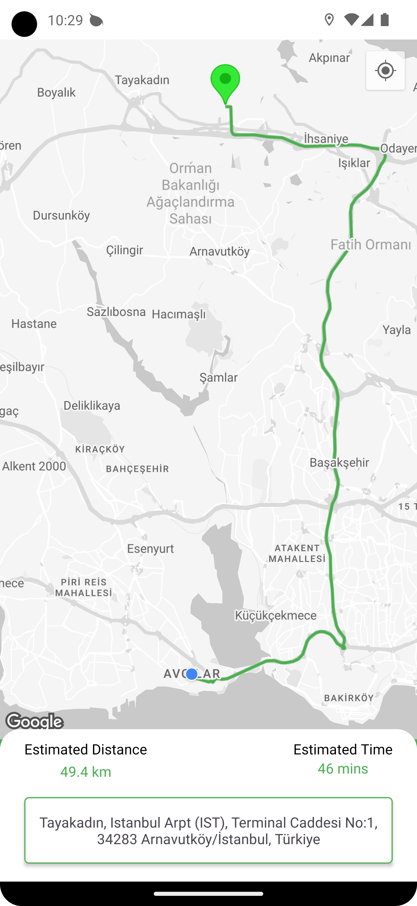

# Android Location and Route Application

This Android application retrieves the user's current location and generates a route to a user-selected destination using Google Maps. The application also provides estimated distance and time information to the user.

| Home | Search Address 
| ----- | ----- |
|||

| Place Detail|Draw Route|
| ----- | ----- | 
|||

## Tech Stack & Open-source Libraries

* **Minimum SDK Level**: 24

* **Programming Language**
  * 100% Kotlin based.

* **Asynchronous Programming**
  * Flow and Coroutines for managing background tasks with simplified code and reducing the need for callbacks.

* **Android Architecture Components**
  * A collection of libraries that help in designing robust, testable, and maintainable apps:
    * **Single-Activity Architecture**: Using the Navigation component for managing fragment operations.
    * **Dependency Injection**: Using Hilt for dependency management, reducing the need for manual dependency injection.
    * **Lifecycle**: Handling UI-related changes with respect to the lifecycle states.
    * **ViewModel**: Managing UI-related data in a lifecycle-conscious way.
    * **Data Binding**: Binding UI components in your XML layout files to data sources.

* **Networking and Data Fetching**
  * **Retrofit**: A type-safe HTTP client for Android and Java.
  * **OkHttp Logging Interceptor**: Logging HTTP request and response data.
  * **Gson Converter**: A Converter which uses Gson for serialization to and from JSON.

* **Security**
  * **AndroidX Security Crypto**: Providing a way to encrypt data safely.

* **Image Loading**
  * **Coil**: An image loading library for Android backed by Kotlin Coroutines.

* **Location Services**
  * **SmartLocation**: Simplifying location APIs.

* **Google Services and Maps**
  * **Google Places**: For accessing place information using Google Places API.
  * **Google Maps**: Integrating Google Maps into the application.
  * **Maps KTX**: Simplifying the use of Google Maps with Kotlin extensions.
  * **Play Services Maps and Location**: Providing APIs for Google Maps and location services.
  * **Android Maps Utils**: Utility library for Google Maps.

* **UI Components and Utilities**
  * **Fragment KTX**: Extensions for simplifying fragment usage.
  * **Lifecycle Extensions**: Extending lifecycle-aware components.
  * **SwipeRefreshLayout**: Implementing swipe-to-refresh functionality.

## Features
- Real-time location retrieval.
- Drawing routes to locations specified by the user.
- Providing estimated distance and time information.
- Selected location information
- Integration with Google Maps API.

## Used API Endpoints
| Feature                 | Endpoint                    | Method | Parameters            | Return Type             |
|-------------------------|-----------------------------|--------|-----------------------|-------------------------|
| Route Retrieval         | `directions/json`           | GET    | `origin`, `destination`| `DirectionResponse`     |
| AutoComplete            | `place/autocomplete/json`   | GET    | `input`               | `AutoCompleteResponse`  |
| Place Details Retrieval | `place/details/json`        | GET    | `place_id`            | `PlaceDetailsResponse`  |

When using the above API endpoints in the application, it's necessary to have a valid Google Maps API key. This key is essential for authenticating and authorizing requests to the Google Maps services. In our application, the Google Maps key is securely sent with each request through the use of a TokenInterceptor within our network package.

## How to Use
To use this application, you need to insert your Google Maps API key. Follow these steps:
- In your TokenInterceptor, replace 'YOUR_API_KEY' with your actual Google Maps API key. Here's the snippet of code from TokenInterceptor
- Next, go to the strings file of your project and replace the 'YOUR_API_KEY' in the following line with your actual API key:
- Finally, run your application.
